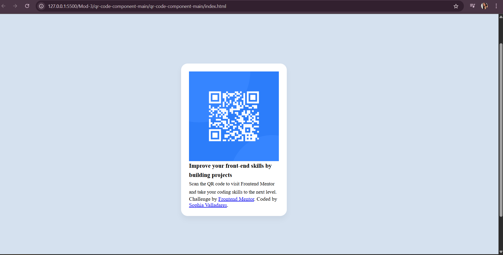

# qr-code-component
# Frontend Mentor - QR code component solution

## Table of contents
- #overview
  - #screenshot
- #my-process
  - #built-with
  - #what-i-learned
  - #continued-development
  - #useful-resources
- #author
- #acknowledgments

## Overview
This project features a responsive QR Code card using HTML and CSS, intended to help developers practice layout, typography and component styling.

### Screenshot

## My process
For this challenge, I began by carefully reviewing the project brief to understand the layout and requirements. I then set up the project structure, creating separate files for HTML, CSS, and assets like the QR code image. Using semantic HTML, I built a clean layout and styled it with a mobile-first approach in CSS, utilizing flexbox for centering and Google Fonts for typography. I focused on consistent spacing, rounded corners, and a simple card design. Once styled, I tested responsiveness across different screen sizes to ensure a good user experience. Finally, I added the required attribution, double-checked the layout, and polished the design to match the original as closely as possible.

### Built with
- Semantic HTML5 markup
- CSS custom properties
- Flexbox
- Google Fonts (Outfit)
- Mobile-first workflow

### What I learned
Through this challenge, I gained more experience in:
- Structuring a simple component layout with semantic HTML.
- Using flexbox to align and center content vertically and horizontally.
- Applying consistent padding, border-radius, and typography styling.

### Continued development
Moving forward, I would like to:
- Add hover effects to links and images.
- Experiment with CSS Grid to see alternate layout approaches.

### Useful resources
[MDN Web Docs - Flexbox](https://developer.mozilla.org/en-US/docs/Web/CSS/CSS_Flexible_Box_Layout)
- [CSS Tricks - A Complete Guide to Flexbox](https://css-tricks.com/snippets/css/a-guide-to-flexbox/)
- [Google Fonts - Outfit](https://fonts.google.com/specimen/Outfit)

## Author
- Frontend Mentor - [@callmesophiii](https://www.frontendmentor.io/profile/callmesophiii)
- GitHub - [https://github.com/callmesophiii/qr-code-component]

## Acknowledgments
 Challenge by [Frontend Mentor](https://www.frontendmentor.io?ref=challenge)
- Coded by Sophia Valladares
I want to acknowledge all the members of Room 5: 4/29-5/02 for collaborating with each other and showcasing our work to one another. If one member of the group was stuck, we would screen share and go through our issues together to find the problem and work through the solution as a team. 
